# 📓 Working Diary

**Record Claude Code and Codex work sessions in one diary.**

[](https://github.com/solzip/working-diary/actions/workflows/ci.yml)
[](https://opensource.org/licenses/MIT)
[](https://www.python.org/downloads/)
[](https://github.com/solzip/working-diary)

> [한국어](README.md) | **English**

> ⚠️ This is a community project, not officially affiliated with Anthropic or OpenAI.

Every AI development session is full of valuable work: tasks completed, files changed, bugs fixed, decisions made. But when the session ends, that context disappears. **Working Diary** records Claude Code and Codex work as structured Markdown diaries or Notion work logs.

The package name and legacy CLI `claude-diary` remain for compatibility. New docs prefer the neutral `working-diary` alias.

```bash
pip install claude-diary
working-diary init
```

<p align="center">
  
</p>

## How It Works

Claude Code can write automatic diaries through its Stop Hook, and both Claude Code and Codex can write manual or Notion diaries on demand.

```
Claude Code session ends
        │
        ├─ Stop Hook fires automatically
        │
        ▼
  Parses transcript → extracts tasks, files, commands, git info
        │
        └─ ~/working-diary/2026-03-24.md

Claude Code / Codex session in progress
        │
        ├─ /diary or $diary
        │     └─ project-organized Markdown diary
        │
        └─ /diary-notion or $diary-notion
              └─ task rows in a Notion work database
```

Claude Code automatic diaries are created when sessions end. Codex records only when you invoke `$diary` or `$diary-notion`.

## Supported Agents

| Agent | Auto Diary | Manual Diary | Notion Work Diary | Install/Refresh |
|-------|------------|--------------|-------------------|-----------------|
| Claude Code | Stop Hook | `/diary` | `/diary-notion` | `working-diary install --force` |
| Codex | - | `$diary` | `$diary-notion` | `working-diary install --force --codex` |

## Supported Platforms

| Platform | Python | Auto Diary | Weekly Summary | Cron |
|----------|--------|------------|----------------|------|
| macOS | python3 | ✅ | ✅ | ✅ |
| Linux | python3 | ✅ | ✅ | ✅ |
| Windows (Git Bash) | python | ✅ | ✅ | ❌ (Use Task Scheduler) |

## What Gets Logged

| Item | Description |
|------|-------------|
| 📋 Task Requests | What the user asked the AI agent to do |
| 📄 Files Created | List of newly created files |
| ✏️ Files Modified | List of edited files |
| ⚡ Key Commands | Important shell commands executed |
| 📝 Work Summary | Summary of AI-performed tasks |
| ⚠️ Issues | Errors or problems encountered |

## Installation

### Option 1: pip (Recommended)

```bash
pip install claude-diary
working-diary init
```

### Option 2: Claude Code Plugin

```bash
# Inside Claude Code
/plugin marketplace add https://github.com/solzip/working-diary
/plugin install working-diary
```

### Option 3: Manual Install

```bash
git clone https://github.com/solzip/working-diary.git
cd working-diary/working-diary-system
./install.sh
```

After installation:
- Stop Hook registered (auto-runs on session end)
- `~/working-diary/` directory created
- Config file generated

To also use Codex skills:

```bash
working-diary install --force --codex
```

## Directory Structure

```
~/working-diary/
├── 2026-03-15.md          ← Daily diary
├── 2026-03-16.md
├── 2026-03-17.md
├── .session_counts.json    ← Internal counter (auto)
├── .gitignore
└── weekly/
    ├── W11_2026-03-09.md   ← Weekly summary report
    └── W12_2026-03-16.md
```

## Manual Diary — `/diary` / `$diary`

For when you want to record an entry mid-session without waiting for the Stop Hook. **Coexists** with the auto diary and lives at a separate, project-organized path.

```
~/working-diary/manual/
└── 2026-04-29/
    └── my-project/
        └── 2026-04-29.md      ← appended on subsequent calls within the same day/project
```

**Usage:**
- Inside a Claude Code session: type `/diary` — reads the current cwd's transcript and writes the entry
- Inside a Codex session: type `$diary` — writes the current conversation/tool context through the same manual diary path
- Or from the terminal: `working-diary write`

`working-diary install` installs `~/.claude/commands/diary.md` so `/diary` works in every project. Re-run it when you need to refresh slash commands. `working-diary uninstall` removes it (preserves user-modified files).
Codex skills can be installed from the Codex plugin in this repo or with `working-diary install --codex`.

## Notion Work Diary — `/diary-notion` / `$diary-notion`

Push the current session to a hierarchical Notion database as task-sized rows. Use `/diary-notion` in Claude Code and `$diary-notion` in Codex.

```
[Notion root page: "Working Diary"]
 └── 2026 (auto-created)
     └── Entries (inline DB, auto-created)
         ├── "Decide Notion DB schema" | Project: working-diary | Purpose: Planning
         ├── "Refactor git_info.py"    | Project: working-diary | Purpose: Refactor
         └── ...
```

Rows include filterable/groupable/relational/operating columns for `Project`, `Purpose`, `Task Group`, `Parent Task`, `Sub-items`, `Depends On`, `Branch`, `Status`, `Work Period`, `Priority`, `Blocked`, `Next Action`, `Review Status`, and `Categories`. `Project` is the command cwd folder name; if a task JSON omits it or writes `unknown`, the CLI falls back to the cwd folder. Run `working-diary diary-notion ensure` to create or verify schema v7, native sub-items, 5 core views, and 5 operating views.
Hierarchy nests through Notion's **native sub-item relation**, which can only be enabled in the Notion UI (locale-named, e.g. `Parent item`/`Sub-item` or `상위 항목`/`하위 항목`): open the year's `Entries` DB → ⋯ menu → Sub-items, once. push then writes each child's parent link into that native relation (auto-detected without hardcoded names), `ensure` points the 작업 계층 view at it and migrates legacy `Parent Task` links over. Until it is enabled, rows are still recorded and push prints a hint; the legacy `Parent Task`/`Sub-items` relation never drove native nesting and is kept hidden. `Depends On` is limited to prerequisite links between large top-level tasks. Do not connect subtasks with dependency relations. `working-diary diary-notion ensure` repairs required core/operating view settings, while `--dry-run` reports update plans without writing. Operating views cover today priority, previous unfinished work, blocked work, review-needed work, and task groups. Each Notion page body stays compact with one top summary callout, checked result items, a work-at-a-glance table, impact bullets, checked verification items, risks/next actions, and appendix toggles. Developer evidence such as code changes, files, commands, Git, and original prompts is hidden in the appendix. Code changes are high-signal summaries, not full diffs; include only behavior, schema, CLI, user workflow, or verification-scope changes.
Titles and narrative body content are written in Korean. File paths, commands, branches, commit hashes, code identifiers, and `Purpose`/`Status` enum values remain literal or English.

```bash
working-diary diary-notion init
working-diary diary-notion ensure
/diary-notion       # Claude Code
$diary-notion       # Codex
```

Purpose values use stable English labels: `Feature`, `Bugfix`, `Refactor`, `Docs`, `Test`, `Infra`, `Planning`, `Research`, `Review`, `Release`, `Support`, `Maintenance`, `General`.

## Diary Example

```markdown
# 📓 Work Diary — 2026-03-17 (Tue)

> This file is auto-generated by Claude Code Stop Hook.
> Work content is automatically recorded at the end of each session.

---

### ⏰ 09:32:15 | 📁 `ai-chatbot`

**📋 Task Requests:**
  1. Implement circuit breaker pattern in WebSocket handler
  2. Update error code definitions

**📄 Files Created:**
  - `.../handler/CircuitBreakerHandler.java`

**✏️ Files Modified:**
  - `.../config/WebSocketConfig.java`
  - `.../constant/ErrorCode.java`

**⚡ Key Commands:**
  - `./gradlew test`
  - `./gradlew bootRun`

**📝 Work Summary:**
  - Circuit breaker pattern implemented in WebSocket handler
  - Added 3-state transition logic (CLOSED→OPEN→HALF_OPEN)
```

## Configuration

| Environment Variable | Description | Default |
|---------------------|-------------|---------|
| `CLAUDE_DIARY_LANG` | Diary language (`ko` or `en`) | `ko` |
| `CLAUDE_DIARY_DIR` | Auto diary storage path | `~/working-diary` |
| `CLAUDE_DIARY_MANUAL_DIR` | Manual diary (`/diary`) storage path | `~/working-diary/manual` |
| `CLAUDE_DIARY_TZ_OFFSET` | UTC offset | `9` (KST) |

```bash
# Add to ~/.bashrc or ~/.zshrc
export CLAUDE_DIARY_LANG="en"
export CLAUDE_DIARY_DIR="$HOME/working-diary"
export CLAUDE_DIARY_TZ_OFFSET="-5"  # EST (UTC-5)
```

**Windows environment variables:**
```powershell
# PowerShell (persistent)
[Environment]::SetEnvironmentVariable("CLAUDE_DIARY_LANG", "en", "User")
[Environment]::SetEnvironmentVariable("CLAUDE_DIARY_DIR", "$env:USERPROFILE\working-diary", "User")
```

## CLI Commands

```bash
claude-diary write                        # Write current session diary on demand (also via `/diary` slash command)
working-diary write                       # Neutral alias for the same CLI
claude-diary search "keyword"             # Keyword search
claude-diary filter --project my-app      # Filter by project
claude-diary trace src/main.py            # File change history
claude-diary stats                        # Terminal dashboard
claude-diary weekly                       # Weekly summary
claude-diary dashboard                    # HTML dashboard
claude-diary audit                        # Security audit log
claude-diary audit --verify               # Source code integrity check
claude-diary config                       # View settings
claude-diary team stats                   # Team statistics
claude-diary team weekly                  # Team weekly report
```

## Features

| Feature | Description |
|---------|-------------|
| Auto Categories | feature/bugfix/refactor/docs/test/config/style auto-tagging |
| Git Integration | Branch, commits, diff stats (+/- lines) auto-recorded |
| Secret Scanning | Passwords, API keys, tokens auto-masked (11+ patterns) |
| Search Index | Fast search across months of diary files |
| 5 Exporters | Notion, Slack, Discord, Obsidian, GitHub plugins |
| HTML Dashboard | GitHub-style heatmap, offline charts (zero CDN) |
| Security Audit | Audit log, SHA-256 checksum tamper detection |
| Team Mode | Access control, central Git repo, team reports |

## Requirements

- Python 3.8+ (`python3` or `python`)
- Claude Code (with hooks support)
- Zero external dependencies (core), no API tokens required

## Tips

**Add to your CLAUDE.md for better diary entries:**

```markdown
## Work Diary
- Work content is automatically recorded when the session ends
- Please output clear summaries when completing/implementing/fixing tasks
```

## FAQ

**"Isn't `git log` enough?"**

git log records *what you committed*. claude-diary records *what you tried, asked for, and debugged* — including sessions where you didn't commit anything. It captures the original prompts ("implement JWT auth"), commands run, errors encountered, and time spent. Think of it as the gap between your commit history and your actual workday.

**"Does it work with Cursor / Windsurf / Copilot?"**

Not yet — currently Claude Code only (via Stop Hook). But the core pipeline just needs `session_id + transcript + cwd`, so adding other AI IDEs is architecturally straightforward. See roadmap below.

**"Why JSON index instead of SQLite?"**

The current JSON index is simple and has zero dependencies. SQLite (which is in Python's stdlib) is planned for v5.0 to enable full-text search and faster queries across months of data.

## Roadmap

| Phase | Goal | Version | Status |
|-------|------|---------|--------|
| **A** | Personal productivity (categories, Git, CLI, plugins, dashboard) | v2.0.0 | ✅ Done |
| **B** | Open source community (security, 420+ tests, CI/CD) | v3.0.0 | ✅ Done |
| **C** | Team/company tool (access control, central repo, team reports) | v4.0.0 | ✅ Done |
| **D** | Distribution (plugin, PyPI, marketplace) | v4.1.0 | ✅ Done |
| **E** | Multi-IDE support (Cursor, Windsurf, VS Code extension) | v5.0.0 | 📋 Planned |
| **F** | SQLite index + full-text search + analytics API | v5.1.0 | 📋 Planned |

See [`docs/plans/`](docs/plans/) for detailed roadmaps.

## License

MIT License — [LICENSE](LICENSE)
